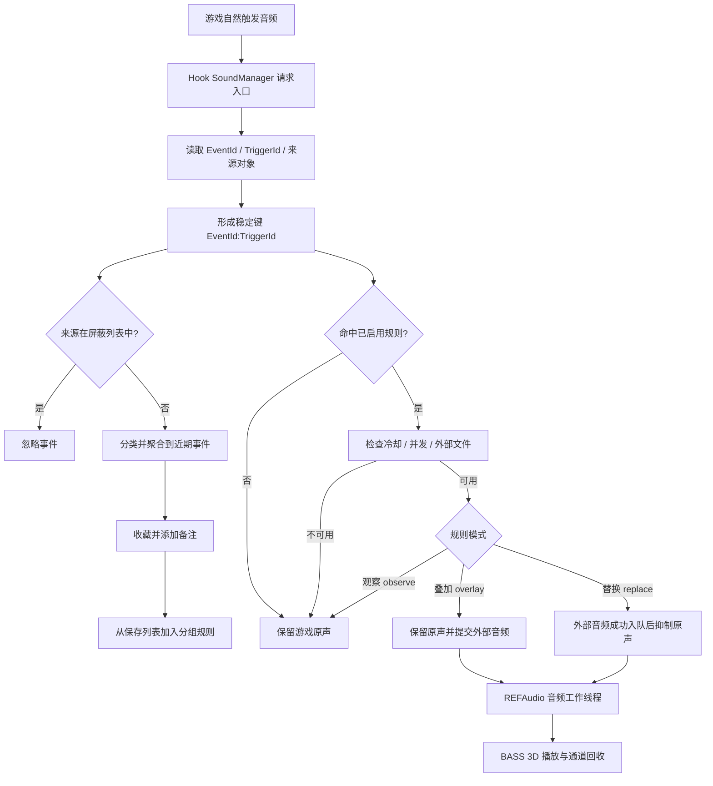

# MHWS Voice Controller

《怪物猎人：荒野》的游戏内音频捕获与替换插件。它可以从游戏实时捕获游戏内的音频，并替换成自己想要的外部音频，支持mp3，wav，ogg格式。


## 运行原理




## 依赖关系

| 名称 | 使用语音包 | 制作和管理语音包 | 作用 |
| --- | --- | --- | --- |
| 怪物猎人：荒野 | 必需 | 必需 | 目标游戏 |
| REFramework | 必需 | 必需 | 加载 Lua 与原生插件，提供基础 UI |
| REFF | **可选** | **必需** | 提供完整管理页面 |

### 不安装 REFF 时

语音包捕获匹配、规则运行、外部音频和 3D 播放均可正常工作。REFramework 的原生面板只提供：

- REFF 是否连接；
- 已安装分组列表；
- 分组启用/禁用开关。

因此，普通语音包使用者只需安装 REFramework、本插件和语音包，不必额外安装 REFF。

### 安装 REFF 后

按 `快捷键(默认F8)` 打开 REFF，在“音频控制器 / Voice Controller”页面中可以使用完整功能：捕获浏览、游戏内音频重放、收藏、备注、屏蔽列表、分组创建、规则编辑、候选试听和配置保存。

REFF 只是管理界面依赖，不参与音频 Hook、规则匹配或 BASS 播放。REFF 断开时，已经保存的分组仍会继续运行。

## 安装

### 前置条件

1. Windows 版《怪物猎人：荒野》。
2. 已正确安装并能运行 [REFramework](https://github.com/praydog/REFramework)。
3. 需要制作或完整管理语音包时，再安装兼容版本的 [REFF](https://github.com/Monkeysama/REFF)。

### 安装插件

将发布包内的 `reframework` 文件夹合并到游戏根目录：

```text
MonsterHunterWilds/
  reframework/
    autorun/
      VoiceController.lua
      VoiceController/
    plugins/
      REFAudio.dll
    data/
      REFAudio/
        REFAudio_BASS.dll
    reff/
      plugins/
        voice-controller/
```

启动游戏后，在 REFramework 主界面展开“音频控制器 / voice_controller”。看到分组列表即表示运行时已加载；安装了 REFF 时还会显示其连接状态。

> 升级时不要覆盖或删除 `reframework/data/VoiceController/replacement.json`、`saved_events.json` 和 `Groups/`，它们是本机配置、收藏和已安装语音包。

## 使用语音包

语音包以单个分组文件夹分发，目录形式如下：

```text
<语音包名称>/
  group.json
  Audio/
    voice_01.ogg
    voice_02.wav
```

1. 将整个语音包文件夹放入：

   ```text
   reframework/data/VoiceController/Groups/
   ```

2. 进入游戏，插件会自动发现新分组。新安装分组默认禁用。
3. 在 REFramework 的“音频控制器”基础面板中启用分组；已安装 REFF 时也可在 F8 的“分组配置”中启用。
4. 在游戏中自然触发对应动作并确认替换结果。

卸载语音包时，直接删除它在 `Groups` 下的整个文件夹。权威目录扫描确认文件夹消失后，会同步清理本机配置中的对应分组记录。

### 冲突规则

如果两个已启用分组使用相同的 `EventId:TriggerId`，只有配置顺序靠前的分组生效。可以在 REFF 的“冲突明细”中确认当前生效项；没有 REFF 时，临时禁用不需要的分组即可消除冲突。

## 制作语音包

推荐使用 REFF 页面完成制作，这样可以避免手工抄写事件 ID，并自动校验目录、规则和音频参数。

### 1. 捕获目标事件

1. 按 `快捷键(默认F8)` 打开 REFF，进入“音频控制器”。
2. 打开“近期事件”，选择玩家、NPC、随从、武器或未分类。
3. 在游戏中自然触发想要替换的声音。
4. 必要时输入来源名称并点击锁定。锁定后只有同时满足当前分类和搜索条件的事件会进入记录列表。
5. 点击播放确认目标事件，再点击收藏。

近期事件显示的稳定键形如：

```text
3499935827:114982064
```

前半部分是 `EventId`，后半部分是 `TriggerId`。游戏对象地址不是规则的一部分，不能用作持久匹配条件。

> 游戏内音频重放用于辨认事件，并不是把音频保存到磁盘。
> 某些声音只有当前场景已经加载对应容器时才能重放；这不影响规则在该事件自然触发时进行稳定键匹配。

### 2. 整理保存列表

在“保存列表”中为事件填写便于辨认的备注名。备注会用于分组配置的事件选择器。
收藏数据永久保存在本机 `saved_events.json`，但分组规则保存后与收藏相互独立；删除收藏不会破坏已有语音包规则。

### 3. 创建分组并放入音频

1. 在“分组配置”中输入名称并创建分组。
2. 将外部音频放入页面显示的目录：

   ```text
   reframework/data/VoiceController/Groups/<分组名>/Audio/
   ```

3. 支持 `.wav`、`.ogg` 和 `.mp3`。文件必须直接位于该分组的 `Audio` 目录，不能使用子目录。
4. 等待目录扫描完成；新音频通常会在 10 秒内出现在选择框中。

分组名允许中文、英文和空格，但不能包含 `\ / : * ? " < > |`，不能以空格或点结尾，最长 64 个字符。

### 4. 添加规则

1. 从保存列表选择游戏内音频。
2. 选择该分组 `Audio` 目录中的外部音频。
3. 点击“添加规则”。新规则默认使用替换模式。
4. 按需调整候选和规则参数：

| 参数 | 说明 |
| --- | --- |
| 权重 | 同一规则有多个候选时的相对随机概率 |
| 音量 | `0.0` 至 `5.0`；新候选默认 `1.5`，`1.0` 为素材原始电平 |
| 速度 | 播放速度，最低 `0.1` |
| 音频长度 | 最大播放时长；添加音频时会采用目录扫描得到的时长 |
| 冷却 | 同一规则两次接受触发之间的最短间隔 |
| 最大并发 | 同一规则可同时占用的外部音频通道数 |
| 模式 | `overlay` 保留原声并叠加；`replace` 播放外部音频并抑制原声 |

候选的试听按钮只播放外部音频，不会触发游戏事件或抑制游戏原声。

### 5. 保存、测试与分发

1. 点击底部“保存配置”。插件先写回各分组的 `group.json`，全部成功后再更新本机运行配置。
2. 启用分组，在游戏中自然触发目标事件。
3. 确认音量、空间方向、距离衰减、冷却和候选随机符合预期。
4. 将整个 `Groups/<分组名>/` 文件夹压缩后分发。
5. 发布包只保留 `group.json` 和 `Audio/`；不要包含 `.tmp`、`.bak`、日志或本机的 `replacement.json`、`saved_events.json`。

一个分组就是一个独立分发单元，不依赖制作者的收藏列表或其他分组。

## group.json 格式

通常不需要手工编辑。需要版本控制或自动生成时，可使用以下最小示例：

```json
{
  "schemaVersion": 1,
  "name": "示例语音包",
  "version": "1.0.0",
  "author": "Your Name",
  "description": "示例说明",
  "rules": [
    {
      "id": "player_attack",
      "eventId": "3499935827",
      "triggerId": "114982064",
      "enabled": true,
      "mode": "replace",
      "replaceStrategy": "skip_original",
      "cooldownMs": 200,
      "maxConcurrent": 1,
      "candidates": [
        {
          "file": "Audio/attack_01.ogg",
          "weight": 1,
          "volume": 1.0,
          "speed": 1.0,
          "maxDurationMs": 2500
        }
      ]
    }
  ]
}
```

## 数据与目录

```text
reframework/data/VoiceController/
  replacement.json          # 本机运行配置和分组启用状态
  saved_events.json         # 永久收藏及备注
  Groups/                   # 已安装或正在制作的语音包
  audio_probe.log           # 滚动日志
  runtime/
    diagnostics.json        # 运行诊断快照
    recent.json             # 近期事件快照
    audio_catalog.json      # 外部音频目录快照
```

中文路径通过 `REFAudio.dll` 的 Windows 宽字符 API 和 UTF-8 桥访问。不要让新的 Lua 文件操作绕过该桥直接读写中文分组路径，否则可能在非 UTF-8 系统代码页上创建乱码目录。

## 报告排错

提供以下内容：
- `reframework/data/VoiceController/runtime/diagnostics.json`
- `reframework/data/VoiceController/audio_probe.log`
- 出问题分组的 `group.json`
- 出问题所在游戏场景

## 许可证

项目源码使用 [MIT License](LICENSE)。随发布包提供的第三方组件仍受其各自许可证约束。
